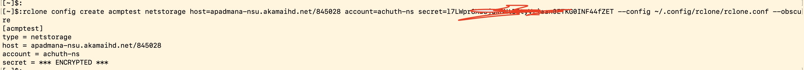
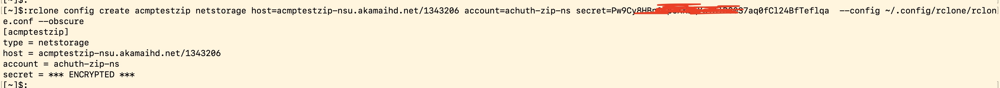
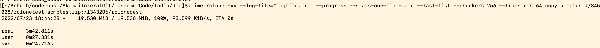
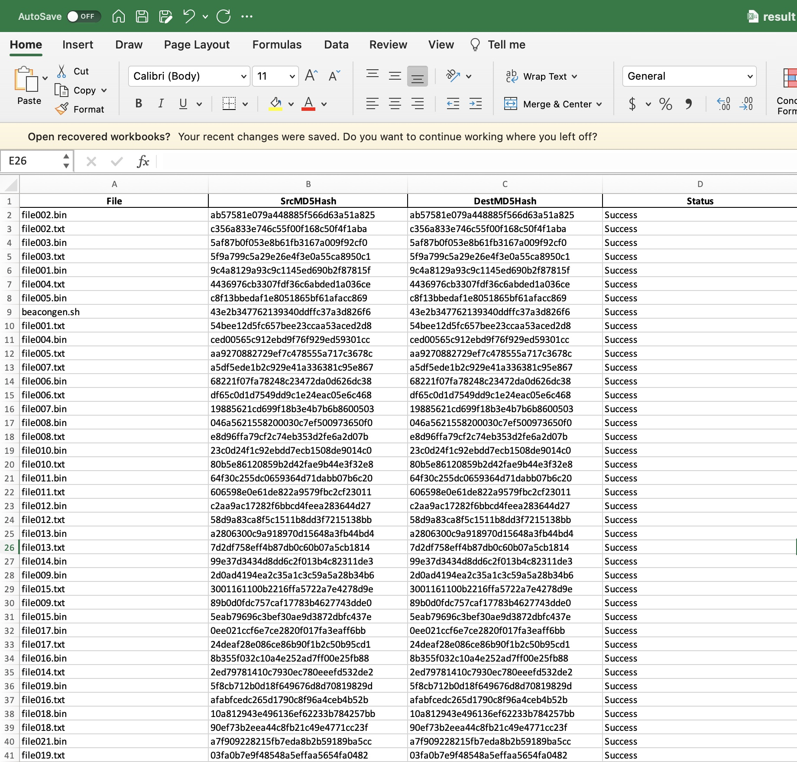

# Akamai Netstorage Migration 
A lot of times if content in NS Storage Group is not managed efficiently, it becomes very difficult to use. Several customers have complained that while using NS, they have faced upload issues/login issues. Also there is a soft limit on the number of files you can upload to Akamai Netstorage. 
This repositry shows how to transfer files from one storage group to another storage group.
This repositry contains the code to check the integrity of the filetransfer between two netstorage groups. This can also be used to check the integrity of filetransfer between any two rclone supported cloud storage.

### Features
- rclone Setup Guide
- Generates the MD5 Hash of source files in source cloud storage
- Generates the MD5 Hash of destination files in destination cloud storage
- Compares and Provides the Results to know the status of the migration.

### Rclone Download
Follow this guide to install [rclone](https://rclone.org/downloads/)

### Installation of Python Dependencies
```
$ pip install -r requirements.txt
```

### Create a rclone config
Create a rclone config for NS using HTTP API Credentials
```
rclone config create <NSSTORAGEGRPNAME> netstorage host=<NSHTTPHOST/CPCODE>account=<UPLOADACCOUNTNAME> secret=<HTTP API KEY>  --config ~/.config/rclone/rclone.conf --obscure
```



### Copy Files
In my example i am copying around files from acmptest Storage Group's folder timessrc to acmptestzip Storage Group's folder timesdest
```
rclone -vv --log-file="logfile.txt" --progress --stats-one-line-date --fast-list --checkers 256 --transfers 64 copy acmptest:/845028/timessrc acmptestzip:/1343206/timesdest
```


### Integrity Check
Once the copy of the files is succesful, it is important to verify if all the files have been transferred and the integrity of the file transfer is not compromised. 
```
python3 integritycheck.py --srcpath 'acmptest:/845028/timessrc' --destpath 'acmptestzip:/1343206/timesdest' --rcloneconf '/Users/apadmana/.config/rclone/rclone.conf'
```

This script will generate the MD5 Checksum of the files in the source storage group and destination storage group and compares them.
Finally an excel file will be generated with the results and status of each transfer.
